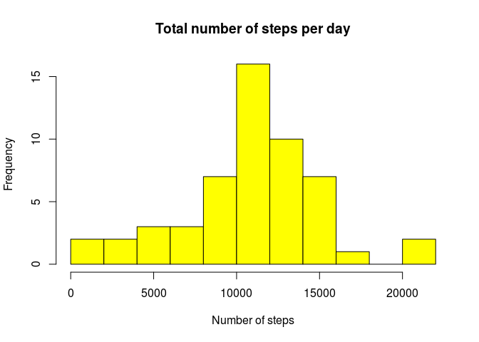

# Reproducible Research: Peer Assessment 1


## Loading and preprocessing the data
Let's load the data and take a quick look at its structure:

```r
    unzip("activity.zip")
    table <- read.csv("activity.csv", header=TRUE, na.strings="NA")
    str(table)
```

```
## 'data.frame':	17568 obs. of  3 variables:
##  $ steps   : int  NA NA NA NA NA NA NA NA NA NA ...
##  $ date    : Factor w/ 61 levels "2012-10-01","2012-10-02",..: 1 1 1 1 1 1 1 1 1 1 ...
##  $ interval: int  0 5 10 15 20 25 30 35 40 45 ...
```

Now let's use the dplyr package in order to better manipulate
the time-type data:

```r
    # If dplyr is not installed please do: install.packages(dplyr)
    suppressMessages(library(dplyr))
    table <- mutate(table, date=as.Date(date))
```

## What is mean total number of steps taken per day?

Let us first calculate the total number of steps taken each day, ignoring the missing values (N.A):

```r
    steps_by_day <- na.omit(group_by(table, date))
    total_by_day <- summarize(steps_by_day, steps=sum(steps))
    head(total_by_day)
```

```
## # A tibble: 6 × 2
##         date steps
##       <date> <int>
## 1 2012-10-02   126
## 2 2012-10-03 11352
## 3 2012-10-04 12116
## 4 2012-10-05 13294
## 5 2012-10-06 15420
## 6 2012-10-07 11015
```
    
Next let's take a look at the histogram of the total number of steps by day:
    

```r
    hist(total_by_day$steps,breaks=10, col='yellow',
    main='Total number of steps per day', xlab='Number of steps')
```

<!-- -->

And finally let's calculate the mean and the median values of the distribution:

```r
    mean_value <- mean(total_by_day$steps)
    median_value <- median(total_by_day$steps)
```

As for the total number of steps taken per day, the mean value is 10766.19, and the median is 10765. Both numbers are virtually identical for this data set.

## What is the average daily activity pattern?
Let us start by estimating the mean number of steps of every 5-minute interval of the day, across all the differente days:

```r
    intervalos <- na.omit(group_by(table, interval))
    mean_interv <- summarize(intervalos, steps=mean(steps))
    head(mean_interv)
```

```
## # A tibble: 6 × 2
##   interval steps
##      <int> <dbl>
## 1        0 1.717
## 2        5 0.340
## 3       10 0.132
## 4       15 0.151
## 5       20 0.075
## 6       25 2.094
```

And now let's take a look ate the time-series plot:

```r
    plot(mean_interv$interval, mean_interv$steps,
     main="Mean number of steps at each 5-minute interval",
     ylab="Number of steps", xlab="Time (in units of 5-minutes intervals)")
```

<!-- -->
    
Finally, let's find the time interval at which the maximum number of steps occurs:

```r
    index <- which.max(mean_interv$steps)
    timeofmax <- mean_interv$interval[index]
```

The 5-minute interval at which the average number of steps -across all the tabulated days- is maximum is the interval number: 835


## Imputing missing values

Let's calculate the total number of missing values:

```r
    missingvals <- sum(is.na(table))
```

There are 2304 missing values (NA) in this data set.


A good strategy to deal with the missing values may be replacing them by the average value at the same time interval -across the rest of the tabulated days-. So, let's create a vector of the full data set, look for all the missing values in it, and replace each of them by the mean value of the corresponding time interval:


```r
    new_values <- table$steps
    for (i in 1:length(new_values)){
        if (is.na(table$steps[i])){
            index <- which(mean_interv$interval==table$interval[i])
            new_values[i] <- mean_interv$steps[index]
        }
    }
```

And now let's create a new table, which is a copy of the original one, but replacing the NAs by the quoted averages; i.e., let's arrange the vector created in the former step to the original form:


```r
    new_table <- mutate(table, steps=new_values)
    head(new_table)
```

```
##   steps       date interval
## 1 1.717 2012-10-01        0
## 2 0.340 2012-10-01        5
## 3 0.132 2012-10-01       10
## 4 0.151 2012-10-01       15
## 5 0.075 2012-10-01       20
## 6 2.094 2012-10-01       25
```

And finally let's calculate again the mean and median values of the distribution of total number of steps taken each day:


```r
    steps_by_day <- na.omit(group_by(new_table, date))
    total_by_day <- summarize(steps_by_day, steps=sum(steps))
    mean_value <- mean(total_by_day$steps)
    median_value <- median(total_by_day$steps)
```
    
After replacing the missing data, the mean value of the total number of steps taken per day is 10766.19, and the median is 10766.19. Now both numbers are exactly the same, and they coincide with the mean value obtained for the original data set.


## Are there differences in activity patterns between weekdays and weekends?

So, first of all we will create a new factor indicating the category (weekdays / weekends) each day belongs to:

```r
    new_table <- mutate(new_table, day=weekdays(date),     
    day=as.factor(weekdays(date)))
    levels(new_table$day) <- c("weekend", "weekday", "weekday", "weekend", "weekday",
    "weekday", "weekday")
    # I note that my system is taking the names of the days in portuguese, which make the order of the levels vary with respect to english
```

Finally, let's plot the time-series at weekdays and weekends to see how they compare to each other:

```r
    intervalos <- group_by(new_table, interval, day)
    mean_interv <- summarize(intervalos, steps=mean(steps))

    library(lattice)
    xyplot(mean_interv$steps ~ mean_interv$interval | mean_interv$day, 
    type = "l", xlab="Interval", ylab="Number of steps", layout=c(1,2))
```

<!-- -->


